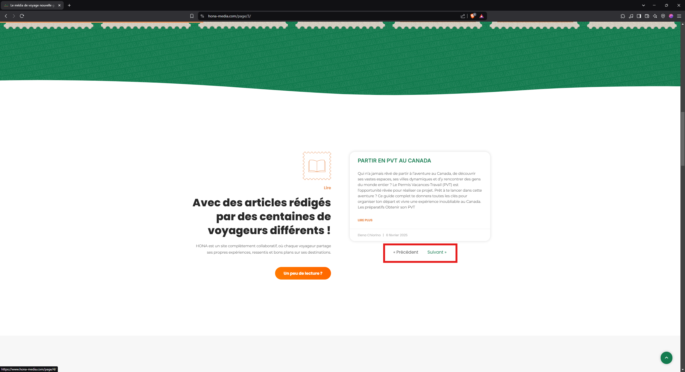
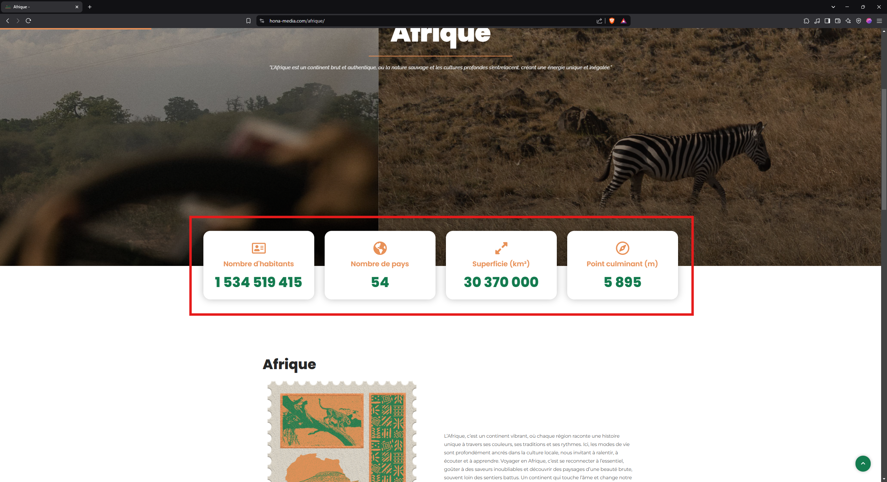
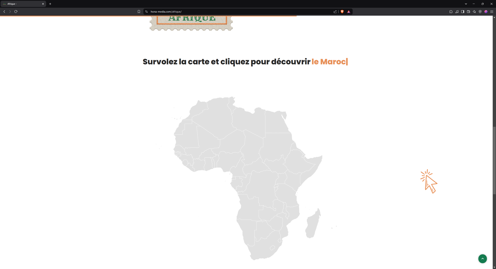
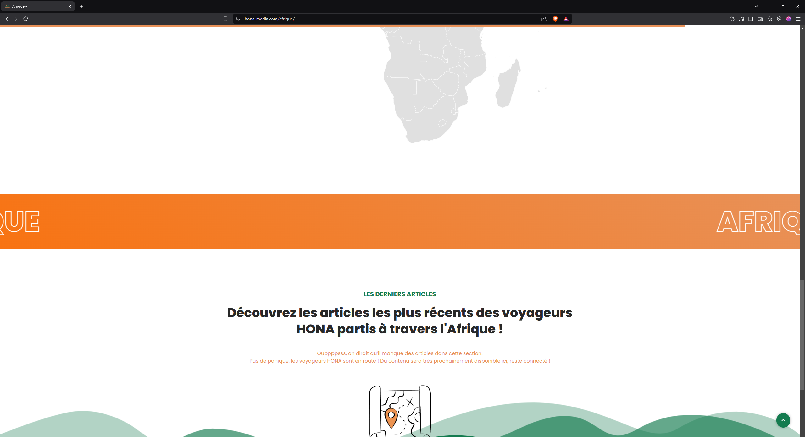
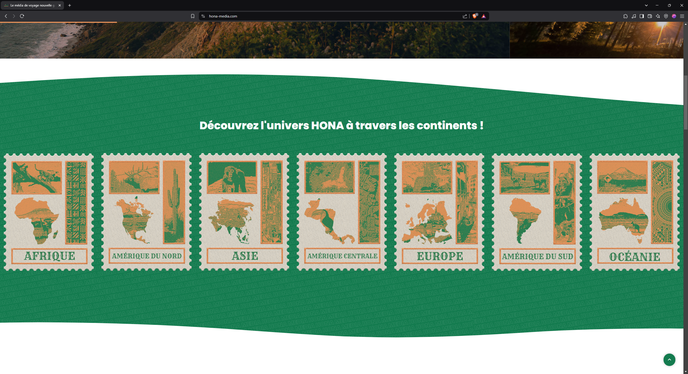
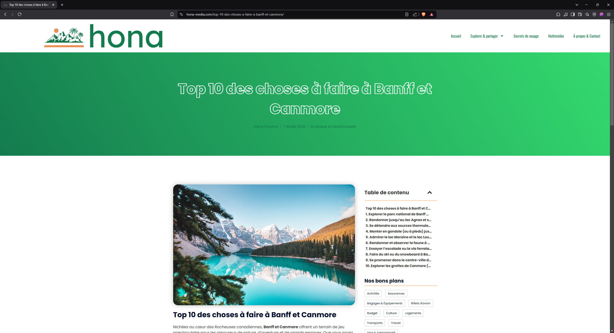
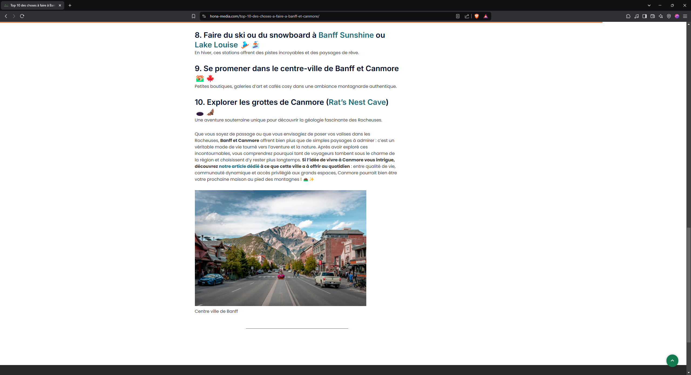
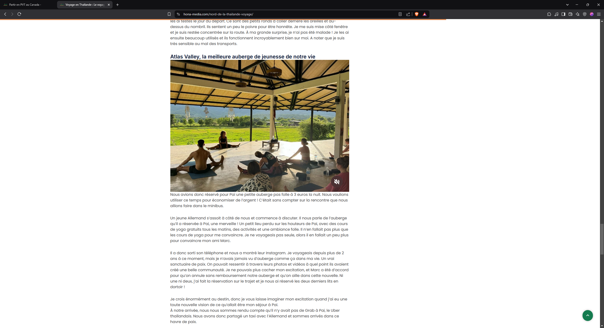
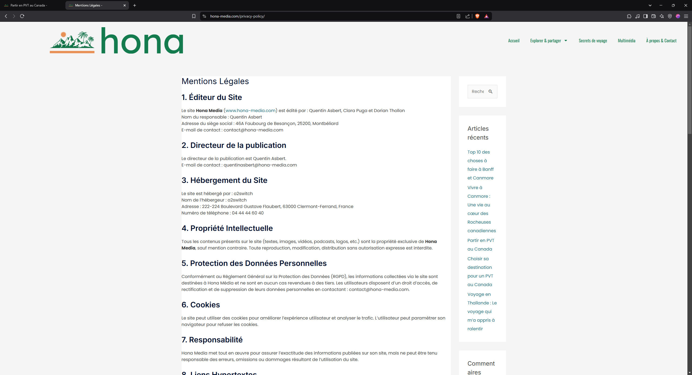

# Review site Hona-Media

## Site Ordinateur

### Page d'accueil

Mauvaise de l'écriture bonne évasion dû à la couleur

Solutions possible:

* Mettre un effet de drop shadow

* Mettre un filtre à certaines images

* faire varier la couleur 

* mettre un fond solide comme plus bas

Au niveau des timbres j'aurais mis un effet pour montrer que c'est cliquable en plus de la souris en `pointer`

Après ça marche bien comme ça c'est juste un plus.

Rafraichissement de la page au clic sur suivant ou précédent, avec une belle animation de transition.

De plus l'animation au survole de l'article est contre intuitif avec le fait que seul le titre est cliquable, ça peut être un choix assumé. 

### Exploration

Pas d'indication sur la hiérarchie des page que ce soit dans l'url ou sur la page ici `Explorer & Partager > Afrique` pas obligatoire mais recommandé.

Ici au chargement dû à l'utilisation d'une police non monospace, au chargement de la page les encadrés changent de taille.

Une solution peut-être de cacher un chiffre quand ils défilent ou de mettre une autre police mais ça n'irait plus ave le reste du site

Carte non cliquable

Soit c'est parce que les pays n'ont pas encore d'articles mais alors faudrait pas mettre des pays pour le moment au dessus. Et mettre un à venir.

Sur la banderole orange j'aurais bien vu un fond en orange écrit Afrique pour faire un rappel au Hona de la page d'accueil.

### Page article

  

Lisibilité de l'auteur, de la date et du lieu après pas très important c'est du texte secondaire

Je ne sais pas comment les articles sont généré mais ça pourrait être intéressant de faire en sorte à ce qu'elle soit dans le même style que la première.

Dans le même esprit les espaces autour des photos

### Mentions Légales

On s'en fou c'est les mentions légales mais quand même 😂

## Mobile

Le `burger menu` pas à une place intuitive même si très mis en avant.

Un bug est présent à l'ouverture, il ne vient pas du bas du blanc, et une animation qui fait la transition entre le `burger` et la `croix` pourrait être un gros plus.

Toute les remarques pour le site ordinateur restent valident.

## Conclusion

Le site est vraiment beau, quelques détails à peaufiner mais sinon vraiment bien comme travail.

Ah dernier détail, sur l'hébergement, il faudrait voir comment ça a été fait mais il est considéré comme frauduleux par mon entreprise !

Je suis disponible pour en discuter !

Mail : robin.guerard@airbus.com

Sinon passez par Elena, je répondrai vite 😂

